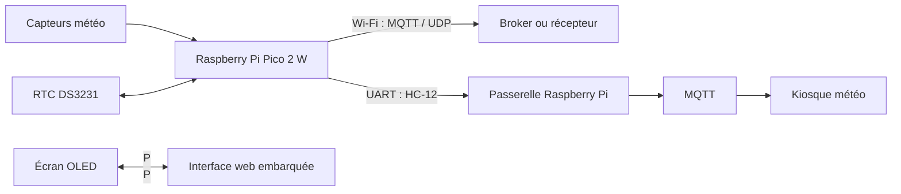
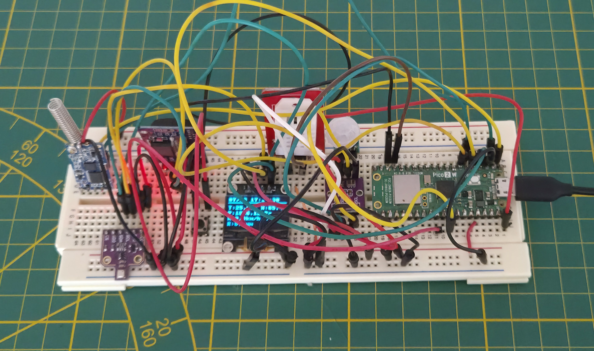
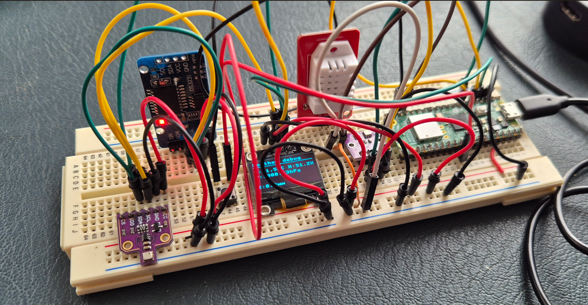
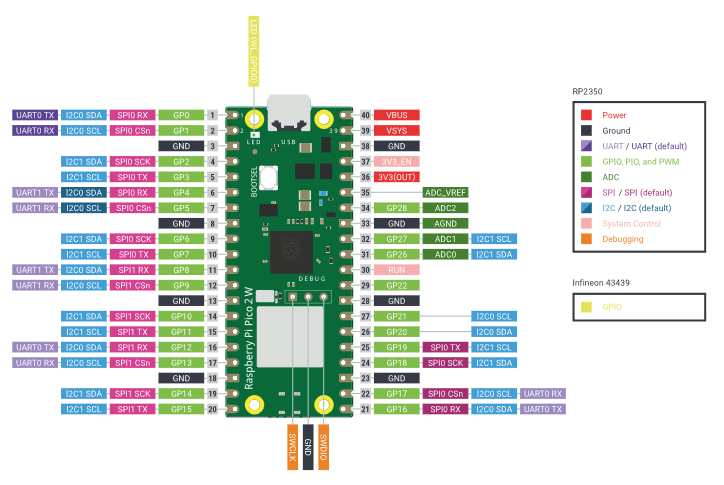
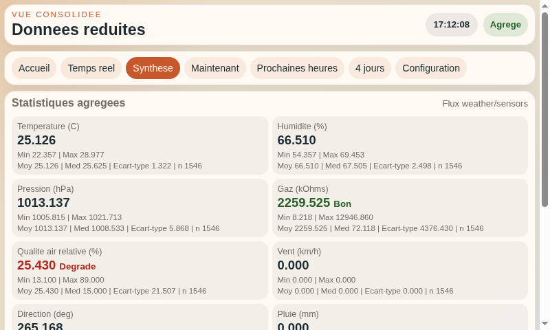
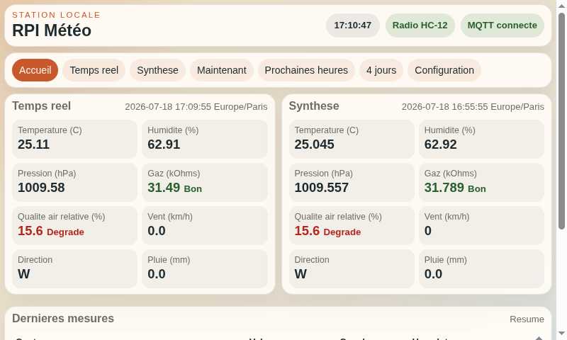

# Weather Web Sensors

Station météo autonome construite autour d'un **Raspberry Pi Pico 2 W**. Elle mesure les conditions locales, compare plusieurs capteurs et diffuse les relevés vers une interface web ou, pour une installation distante, vers un Raspberry Pi par radio HC-12.

## Objectifs

- mesurer température, humidité, pression, qualité de l'air, vent et pluie ;
- comparer plusieurs capteurs afin d'observer leurs écarts ;
- continuer l'acquisition sans navigateur ni connexion Wi-Fi permanente ;
- afficher les mesures localement sur OLED et dans une interface web ;
- transporter les données par Wi-Fi/MQTT, UDP, USB série ou radio HC-12.

## Architecture

Le firmware est organisé en trois ensembles principaux :

- `sensors/` pilote les capteurs et produit une mesure unifiée ;
- `app/` orchestre l'acquisition, l'affichage, le serveur web et les exports ;
- `main.py` initialise la station à partir de `config.py`.

Le Pico acquiert et met en cache les mesures de façon autonome. L'interface web consulte ce cache : elle n'est donc pas nécessaire au fonctionnement de la station.

## Matériel

- [Raspberry Pi Pico 2 W](https://www.raspberrypi.com/products/raspberry-pi-pico-2/)
- [BME680](https://www.bosch-sensortec.com/media/boschsensortec/downloads/datasheets/bst-bme680-ds001.pdf) : température, humidité, pression et résistance du capteur de gaz
- [DHT22](https://fr.aliexpress.com/item/32759901711.html) : température et humidité
- [AHT20 + BMP280](https://fr.aliexpress.com/item/1005008139283157.html) : température, humidité et pression atmosphérique
- [Écran OLED SSD1306](https://fr.aliexpress.com/item/1005007706726114.html)
- anémomètre, girouette et pluviomètre
- module radio série HC-12 433 MHz
- détecteur de présence AM312 pour la gestion de l'écran OLED
- [horloge temps réel DS3231](https://www.analog.com/media/en/technical-documentation/data-sheets/ds3231.pdf)
- platine d'essais et [câbles Dupont](https://fr.aliexpress.com/item/1005007430055417.html)
- [Thonny](https://thonny.org/) ou Visual Studio Code avec [MicroPico](https://github.com/paulober/MicroPico)
- [MicroPython pour Pico 2 W](https://micropython.org/download/RPI_PICO2_W/)

## Prototype et câblage

Ces deux vues restent volontairement dans le README : elles permettent d'identifier rapidement le montage physique avant de consulter les tableaux de broches détaillés du wiki.

### Évolution du prototype sur platine d'essais

*Version finale avec transmission radio et détecteur de présence*

*Première version du prototype*

### Plan de câblage du Pico 2 W

## Aperçu

### Interface web du Pico

### Kiosque du projet compagnon `rpi3-meteo`

Les mesures envoyées par la station peuvent être agrégées et affichées sur un Raspberry Pi.

| Synthèse des mesures | Prévisions et mesures locales |
| --- | --- |
|  |  |

## Démarrage rapide

1. Installer [MicroPython pour Pico 2 W](https://micropython.org/download/RPI_PICO2_W/).
2. Copier `wifi_secrets.example.py` vers `wifi_secrets.py` s'il est présent, ou créer ce fichier avec `ssid` et `password`.
3. Adapter les capteurs et le mode de transport dans `config.py`.
4. Déployer le projet sur le Pico puis lancer `main.py`.
5. En mode Wi-Fi, ouvrir l'adresse IP affichée par la station.

## Documentation technique

Les détails d'implémentation et les procédures d'exploitation se trouvent dans le wiki :

- [Vue d'ensemble du wiki](https://github.com/jgrelet/weather_web_sensors/wiki)
- [Matériel et câblage](https://github.com/jgrelet/weather_web_sensors/wiki/Hardware-and-wiring)
- [Configuration, horloge et acquisition](https://github.com/jgrelet/weather_web_sensors/wiki/Configuration-and-time)
- [Transports et export des mesures](https://github.com/jgrelet/weather_web_sensors/wiki/Transports-and-exports)
- [Exploitation et dépannage](https://github.com/jgrelet/weather_web_sensors/wiki/Operations-and-troubleshooting)

Les sources Markdown de ces pages restent également versionnées dans `docs/wiki`.

## Origine et licence

Le projet s'inspire de l'article [Connecting BMP280 sensor with Raspberry Pi Pico W](https://iotstarters.com/connecting-bmp280-sensor-with-raspberry-pi-pico-w/). Consultez [LICENSE](LICENSE) pour les conditions d'utilisation.
